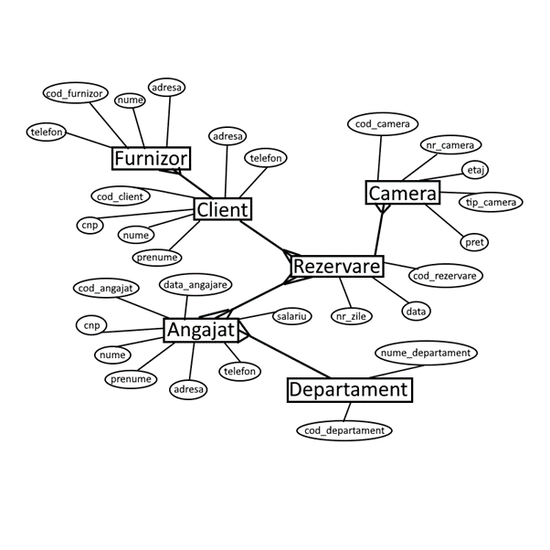

# Gestiunea unui Hotel

Chițiga Alexandru Gabriel

#
## **Cuprins**

[1. Tema 3](#_Toc139070433)

[2. Analiza problemei 3](#_Toc139070434)

[3. Specificarea cerințelor 3](#_Toc139070435)

[4. Proiectarea la nivel conceptual: diagrame in toate relațiile 4](#_Toc139070436)

[5. Proiectarea la nivel logic: schema bazei de date relaționale 4](#_Toc139070437)

[6. Proiectarea la nivel fizic: modelul fizic al datelor 5](#_Toc139070438)

[7. Implementare 7](#_Toc139070439)

# 1. Tema

Gestiunea unui hotel

# 2. Analiza problemei

Indiferent unde îți petreci vacanțele, ai nevoie de un loc elegant și primitor pentru a te odihni și a relua munca. Am ales acest subiect pentru a-i ajuta pe hotelieri și, eventual, pentru a-i motiva pe hotelieri să documenteze mai bine ceea ce fac în hotelurile lor. În același timp, cred că sunt foarte multe hoteluri care vor să beneficieze de planificarea și definirea greșită a ceea ce au de făcut.

Clienții trebuie să poată face rezervări prin intermediul sistemului online. La momentul rezervării trebuiau sa achite in avans 10% din camera, iar daca nu se prezentau renunța la acest avans. Rezervările pot fi plătite cu un card de credit precum Visa sau MasterCard.

Când un client se prezintă la hotel, clientului i se va cere să furnizeze informații despre identitatea sa, cum ar fi numele, CNP etc.

Camerele de hotel pot avea echipamente diferite. De exemplu, într-un hotel, diagonala televizorului în unele camere este de 51 cm, iar diagonala televizorului în unele camere este de 80 cm. Pe lângă facilitățile camerei, oaspeții pot alege și se bucură și de o serie de servicii suplimentare, bineînțeles contra cost, cum ar fi utilizarea sălii de sport, piscină, tur cu ghid al orașului, room service, mic dejun, cină etc. Pentru a oferi clienților cele mai bune condiții, managerii hotelurilor fac tot posibilul pentru a satisface toate cerințele clienților. Uneori, clienții solicită servicii pe care hotelul nu le poate oferi cu personalul și echipamentele sale, cum ar fi plimbările cu snowmobilul. În acel moment, a trebuit să apeleze la serviciile furnizorilor externi pentru a satisface clienții. La sfârșitul unui sejur la hotel, clienții au posibilitatea de a-și exprima părerea, cum ar fi reclamații sau complimente, cu privire la calitatea serviciilor pe care le-au primit în timpul șederii.

# 3. Specificarea cerințelor

-Logarea in aplicație.

-Afișarea tabelei angajat.

-Operații pe tabela angajat precum Inserarea in tabela, ștergerea liniilor din tabela si editarea liniilor respective.

# 4. Proiectarea la nivel conceptual: diagrame in toate relațiile

# 5. Proiectarea la nivel logic: schema bazei de date relaționale

furnizor[cod\_furnizor, nume, adresa, telefon, cod\_client];

client[cod\_client, cnp, nume, prenume, adresa, telefon];

rezervare[cod\_rezervare, cod\_client, cod\_angajat, data, nr\_zile];

camera[cod\_camera, nr\_camera, etaj, tip\_camera, pret, cod\_rezervare];

angajat[cod\_angajat, cnp, nume, prenume, adresa, telefon, salariu, data\_angajare, cod\_departament];

departament[cod\_departament, nume\_departament];

# 6. Proiectarea la nivel fizic: modelul fizic al datelor

FURNIZOR:

CLIENT:

REZERVARE:

CAMERA:

DEPARTAMENT:

ANGAJAT:

# 7. Implementare

**Tehnologii folosite:**

- PHP
- HTML
- JAVASCRIPT
- CSS
- SQL
- XAMPP

**PHP** este un limbaj de programare. Numele PHP provine din limba engleză și este un acronim recursiv : **P** hp: **H** ypertext **P** reprocessor. Folosit inițial pentru a produce pagini web dinamice, este folosit pe scară largă în dezvoltarea paginilor și aplicațiilor web. Se folosește în principal înglobat în codul HTML.

**HTML** (HyperText Markup Language) este un limbaj de marcare utilizat pentru crearea paginilor web ce pot fi afișate într-un browser (sau navigator). Scopul HTML este mai degrabă prezentarea informațiilor – paragrafe, fonturi, tabele ș.a.m.d. – decât descrierea semanticii documentului. În cadrul dezvoltării web de tip front-end, HTML este utilizat împreună cu JavaScript și CSS.

**JAVASCRIPT** (JS) este un limbaj de programare orientat obiect bazat pe conceptul prototipurilor. Este folosit mai ales pentru introducerea unor funcționalități în paginile web, codul JavaScript din aceste pagini fiind rulat de către browser.

**CSS** (Cascading Style Sheets) este un standard pentru formatarea elementelor unui document HTML. Stilurile se pot atașa elementelor HTML prin intermediul unor fișiere externe sau în cadrul documentului, prin elementul \<style\>.

**SQL** este un limbaj de programare specific pentru manipularea datelor în sistemele de manipulare a bazelor de date relaționale (RDBMS), iar la origine este un limbaj bazat pe algebra relațională. Acesta are ca scop inserarea datelor, interogații, actualizare și ștergere, modificarea și crearea schemelor, precum și controlul accesului la date.

**XAMPP** este un pachet de programe free software, open source și cross-platform web server, care constă în Apache HTTP Server, MySQL database și interpretoare pentru scripturile scrise în limbajele de programare PHP și Perl. Noi folosim aplicația XAMPP pentru a accesa o baza de date locala MySQL pe care o accesam folosind phpMyAdmin.

Proiect Proiectarea Aplicațiilor WEB
